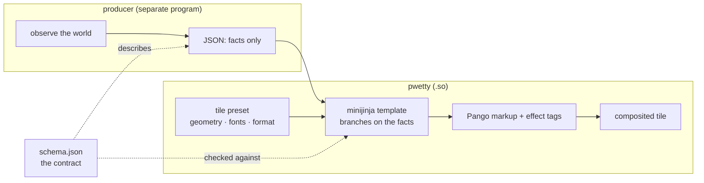

# ADR-0001: Tiles are data-driven; the producer never picks a layout

## Context

A pwetty tile has two halves:

- the **pretty half** — geometry, fonts, colours, the `format` template, the
  effect tags. It knows how a thing should look.
- the **data half** — a JSON object emitted by some other program: a niri
  desktop's sessions, a fleet's per-repo agent counts, a host's CPU load.

Something has to decide, per payload, *which* layout gets drawn. A desktop with
one Claude session looks different from one with two, which looks different from
one holding an ordinary window. A fleet with three repos draws three rows.

The obvious place to put that decision is the producer: it already knows what it
found. It could emit `{"layout": "dual", …}`, or waybar could reference
`cffi/pwetty#claude-dual` and the producer could pick the module. Both were on
the table and both were rejected.

## Decision

**The template renders from what you send. The producer never picks a layout.**

Waybar always references the tile by one name (`"tile": "claude"`). The producer
emits data — the *facts* it observed — and the template branches on those facts:

```jinja
…dual layout……single layout…
```

Concretely, this means:

- No `layout`, `variant`, `style` or `template` field in any tile schema. A
  schema describes **observations**, not presentation.
- Colour is allowed in the data (`cpu.color`) *or* in the template
  (``) — the producer may state a severity it computed, but
  it states it as a fact about the world, not as a rendering instruction.
- One waybar module per tile *name*, never per tile *state*.



The seam is the JSON Schema, and `pwetty check` holds both sides to it: every
`{{ … }}` the template binds must be declared, and every sample must render.

## Alternatives, priced

**A `layout` field in the payload.**
Cost: the producer must know the tile's layout vocabulary, so a layout rename in
this repo becomes a coordinated release across two repositories. Every new layout
needs a producer change before it can be used. And the field is unfalsifiable —
nothing can check that `"layout": "dual"` matches a payload that carries one
session. Rejected.

**One waybar module per state (`cffi/pwetty#claude-single`, `#claude-dual`).**
Cost: waybar's config is static, so the module set would have to be regenerated
and waybar restarted whenever a desktop gained a second session — a restart per
state transition, on a bar. It also multiplies module instances by states, each
with its own `exec`. Rejected.

**Producer emits Pango markup directly, no template.**
Cost: it works, and it is the shortest path — but it moves the pretty half into
every producer. Two producers then diverge visually, `<glow>`/`<wrap>`/`<icon>`
semantics have to be documented as a wire format rather than an internal seam,
and auto-escaping is gone: any producer bug becomes a markup-injection bug in the
bar. The tile gate would have nothing left to check. Rejected — this is the
decision, inverted.

**Template supplied by the waybar config instead of bundled.**
Cost: none for a one-off tile, and this is *still supported* (`format` in the
module block, `tile_file` for an external preset). It is not the default because
a bundled preset is what lets the tile carry a schema, samples and a README that
`pwetty` can print — the whole introspection surface a producer needs. Kept as an
escape hatch, not as the model.

## Consequences

- A producer can be developed against `pwetty schema <tile>` and
  `pwetty render <tile> --data -` without this repo being rebuilt.
- Adding a layout is a template change here — no producer release.
- Tile schemas are permissive by construction (`additionalProperties: true`),
  because the producer is allowed to learn new facts before we render them. See
  [tiles.md](../tiles.md).
- The template carries branching logic, which is real complexity in a Jinja
  template. `pwetty check` compensates by rendering every sample, and the
  `samples/` directory is therefore the tile's test suite — a state without a
  sample is a state nobody has ever rendered.
