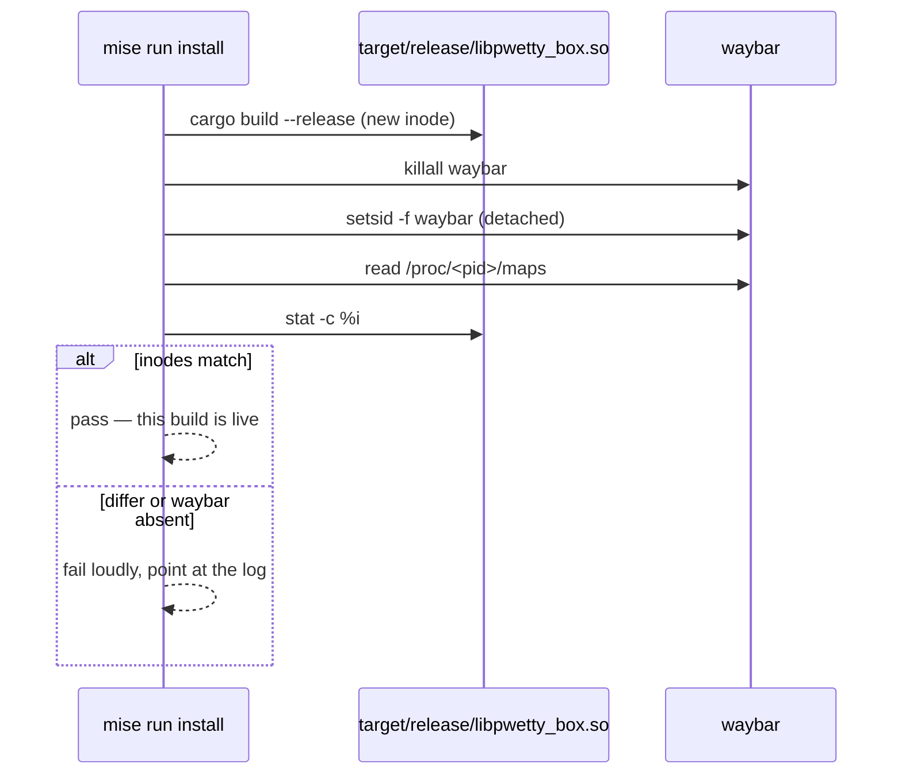

# ADR-0002: Installing means restarting waybar, and proving the inode

## Context

Waybar `dlopen`s the CFFI module in-process. `killall -SIGUSR2 waybar` is the
documented way to reload waybar, and it does reload the config and recreate CFFI
modules — but it **never `dlclose`/`dlopen`s the library**.

So after `cargo build --release` replaces `target/release/libpwetty_box.so`, the
running waybar keeps executing the *old* code, mapped against an inode that no
longer has a name. Nothing fails. Nothing logs. The bar looks fine. The change
you just made is simply absent, and stays absent until something restarts waybar
— which, on a niri session with `spawn-at-startup`, may be the next reboot.

This cost hours before it was understood, and it is the kind of failure that
recurs, because the wrong command is the one every waybar document recommends.

## Decision

**`mise run install` restarts waybar, and the restart is not complete until the
mapped inode matches the file on disk.**

Three parts, each load-bearing:

- **Kill and relaunch**, not signal. SIGUSR2 cannot pick up a rebuilt `.so`.
- **Relaunch detached** (`setsid -f`). niri's `spawn-at-startup` will not respawn
  a bar that the user's own tooling killed, so the task must bring it back
  itself.
- **Verify the inode.** Compare the `libpwetty_box.so` mapping in
  `/proc/<pid>/maps` against `stat -c %i` on the file. A restart that cannot
  prove it loaded the new code is not a gate — it is a hope.

The `.so` is deliberately **not copied anywhere**: every `module_path` in the
waybar config points straight at `target/release`, so building it *is* installing
it. The only step that has to happen after a build is the restart.

## Alternatives, priced

**Trust SIGUSR2 and document the caveat.**
Cost: zero to implement, and it is what the ecosystem does. It is also exactly
the failure above — a silent, hours-long no-op whose symptom ("my change did
nothing") points at the code, not at the loader. The documentation does not help,
because the person hitting it does not yet know they have hit it. Rejected.

**Restart without verifying.**
Cost: cheap, and right most of the time. It fails in the two cases that actually
happen: waybar not coming back at all (a config error, a crash on the new
module), and waybar coming back against a stale path. Both then present as "the
build did nothing" — the same indistinguishable symptom the verification exists
to split apart. Rejected: two lines of `awk` and `stat` buy the difference
between a restart and a proof.

**Copy the `.so` to a versioned path and point waybar at the new one.**
Cost: a real fix for the stale-inode problem — but it needs the waybar config
rewritten on every build, which means owning the user's config file, and it
leaves a directory of old `.so`s to garbage-collect. It also does not remove the
restart: waybar still has to be told to load the new path. Rejected as more
machinery for the same restart.

**A file watcher that restarts waybar on `.so` change.**
Cost: a background daemon in a project that is a bar module, restarting the
user's bar at times they did not choose — including mid-`cargo build`, when the
linker has written a partial file. Rejected.

## Consequences

- `mise run restart` is a standalone task, and `install` depends on `build` and
  then calls it. Either can be run alone.
- The restart is **not** a leg of `mise run check`. A check that kills your bar
  is one you stop running.
- The verification is Linux-specific (`/proc/<pid>/maps`). That is acceptable:
  waybar is Linux-only.
- Anyone reading `README.md` is told the *why* before the *how*, because the
  wrong command is the intuitive one.
