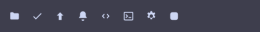

# Data, templates and markup

The model is **data-bound templates**. A command emits a **JSON object** (the
data); `format` is a [minijinja](https://github.com/mitsuhiko/minijinja) template
(Jinja-style `{{ … }}` / ``) that binds fields into **Pango markup**.
Nothing between the producer and the pixels picks a layout — see
[ADR-0001](adr/0001-data-driven-tiles.md) for why.

```jsonc
"exec": "sysinfo.sh",   // prints e.g. {"host":"nas","cpu":{"pct":82,"color":"#fab387"},"mem":{"used":"7.1G"}}
"interval": 2,
"format": "<span size='xx-large' weight='bold'>{{ host }}</span>\n<span foreground='{{ cpu.color }}'>CPU {{ cpu.pct }}%</span>  MEM {{ mem.used }}\n<span foreground='#f38ba8' weight='bold'>⚠ high</span>"
```

- **Binding:** `{{ host }}`, `{{ cpu.pct }}`, `{{ items[0].name }}` — object
  fields are top-level; a non-object (plain-text) command is available as
  `{{ value }}`.
- **Safety:** bound values are auto-escaped (XML), so command output can't break
  the markup; the template's own `<span>`s are preserved.
- **Logic:** filters (`{{ x | round }}`, `{{ y | default('?') }}`) and
  ``/`` — so **state styling lives in the data or the
  template** (the script picks a colour, *or* the template branches on a
  threshold). No separate "states" system.

## Effect tags

On top of standard Pango tags, **custom effect tags** are extracted and drawn by
our own renderer, positioned via the Pango layout:

```jsonc
"format": "vol <box bg='#f38ba8cc'>{{ value }}</box>"   // rounded highlight behind the value
```

- `<box bg='#rrggbb[aa]'>…</box>` — a Cairo rounded highlight behind the span.
- `<glow color='#rrggbb'>…</glow>` — a soft, gently pulsing **GPU-shader** halo
  behind the span (a built-in shader rendered through the shared shader cache).

Both are positioned via the Pango layout (`markup::process` → effect span →
`text::span_rect` → draw). A user-supplied per-span `<shader src='…'>` is the
next addition on the same seam. Combine with `` for conditional effects
(e.g. glow a value only when it's critical).

## Inline embeds & the ticker

Some elements are **placed inline** in the text flow rather than laid out as
glyphs — they reserve a fixed-width box that surrounding text composes around,
**across multiple lines** (`\n` in the template starts a new line). The embeds
that ship today:

- `<wrap>…</wrap>` — a **word-wrapped text block**: the inner text flows onto as
  many lines as it needs (within the tile width), vertically centered as a block.
  Static — no motion. This is how the bundled `claude` tile renders titles.
- `<tickerbox width="N">…</tickerbox>` — a **scrolling marquee** for content
  wider than its box: clipped, scrolling briskly, looping with a `◆` seam marker.
  Renders static (no scroll) when the content fits. (Animated — prefer `<wrap>`
  for long static text; reach for the marquee only when horizontal motion is the
  point, since it forces a per-frame repaint.)
- `<status state="…" level="N"/>` — an **animated session indicator**: `working`
  and `shell` render the pixel-art Claude mascot (orange / electric-cyan, each
  with a color-matched glow), `prompt` a blinking `?`, `idle` a static fade bar
  keyed by `level`.
- `<icon name="…"/>` / `<icon src="…"/>` — an **SVG icon** (see below).
- `<sep/>` — a thin gap that splits adjacent text into independent runs (so a
  digit and a word don't share one Pango baseline).

Inline symbols (status, icons) are sized to the **ink box of the digit/text
beside them** and centered on the line, so they read as peers — no font-glyph
baseline wrangling.

```jsonc
"exec": "now-playing.sh",
"format": "<b>NOW</b>  <tickerbox width='300'>♪ {{ artist }} — {{ title }}</tickerbox>  {{ time }}"
```

→ a bold label, a 300px scrolling ticker, and a value — composed on one line.
Animation auto-enables; inner Pango markup is preserved. This inline-embed seam
(`markup::Embed` → measured placement → draw into the box, laid out by
`draw_flow`) is where future `<bar>`/`<ring>`/`<sparkline>` elements will live.
(v1: a tile uses either inline embeds or `<box>`/`<glow>` span effects, not
both.)

## Icons

Icons are **SVG**, not font glyphs — rasterized with `resvg` (pure Rust) at the
exact device resolution and composited onto the tile. That means crisp at any
size/scale, and *unlimited* — no font can give you every app's logo.

```jsonc
"format": "<icon name='git' color='#a6e3a1'/> {{ branch }}"
```

- `<icon name="…"/>` — a **bundled** icon (ships inside the module).
- `<icon src="/path/to.svg"/>` — any **external** SVG (e.g. a freedesktop app
  icon). Reads are bounded and non-blocking; a FIFO or an oversized file is
  refused rather than stalling the bar.
- `color="#rrggbb"` (optional) — tint the SVG as a monochrome silhouette; omit it
  to keep the artwork's own colours (e.g. a multi-colour app logo).
- `hero="1"` — draw the icon large in a left gutter, with the text indented past
  it.
- `watermark="1"` — draw the icon large and dimmed in the *background*, biased
  right; the text rides over it at full width, under a soft dark halo that keeps
  light text legible over the artwork. Used by the plain-window layout of the
  `claude` tile.

Each icon is sized to the neighbouring digit/text and centered on the line
(except `hero`/`watermark`, which scale to the tile).

**Bundled set:**



`folder` · `check` · `arrow-up` · `bell` · `code` · `terminal` · `gear` · `app`

Add more by dropping `.svg` files in [`icons/`](../icons) and registering them in
`src/svg.rs`, or just point `src=` at your own files.
