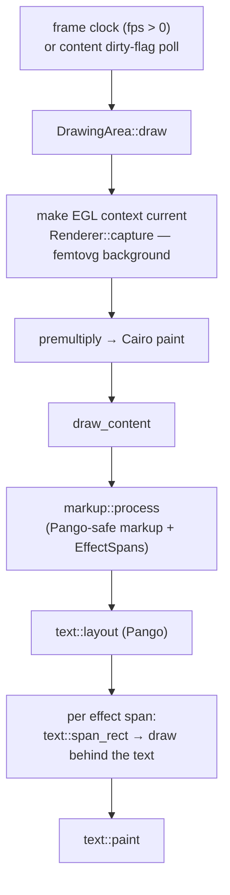

# The render pipeline

Waybar loads the compiled `.so` in-process and hands the module a GTK widget.
Every tile is drawn as **two composited layers** onto a `GtkDrawingArea`:

- a **GPU layer** — [femtovg](https://github.com/femtovg/femtovg) rendered into
  an offscreen image on our own surfaceless EGL context (backgrounds, gradients,
  shader effects);
- a **text layer** — rich **Pango markup** drawn with PangoCairo on top.

Both go through **Cairo**, which gives true per-pixel transparency against a
translucent bar and lets **custom effect tags** (e.g. `<box>`) bridge the two —
positioned via the Pango layout, drawn by the GPU/Cairo layer.

## Why it is built this way

Verified against the installed `waybar` binary (`v0.15.0`) and GTK `3.24.52`:

| Constraint | Consequence |
|---|---|
| Waybar links **GTK3** (`libgtk-3`, `libgtkmm-3.0`); the CFFI ABI's `get_root_widget()` returns a GTK3 `GtkContainer*` | We are a GTK3 in-process widget. (`waybar-cffi` binds gtk-rs 0.18.) |
| Waybar links **no Vulkan**, and GTK3 has no Vulkan surface widget | Rendering is OpenGL (via femtovg). We create our own **surfaceless EGL** context on the DRM render node — no window, no seat, no DRM-master. |
| **`GtkGLArea` cannot alpha-composite against a translucent bar** in GTK3 (verified on hardware *and* software on 3.24.52: transparent regions render as opaque black) | We do **not** use `GtkGLArea`. Instead we render femtovg offscreen, read it back, and composite via **Cairo** onto a `GtkDrawingArea` — Cairo honors per-pixel alpha, so the tile is genuinely transparent against a see-through bar. Cost is a small GPU→CPU readback per frame, negligible for a bar tile. |

The surfaceless context is also what makes the whole render path testable
without a display: `EGL_PLATFORM=surfaceless LIBGL_ALWAYS_SOFTWARE=1` runs the
same code headless, which is how `pwetty render` and CI produce PNGs. See
[testing.md](testing.md).

## Per-frame flow



`markup::process` is the seam: it routes standard Pango tags through untouched
and pulls our own tags (`<box>`, `<glow>`, `<icon>`, the inline embeds) out as
`EffectSpan`s that the draw path positions from the laid-out Pango layout.

## Where the code lives

```
src/
  lib.rs        CFFI Module impl — adds a GtkDrawingArea to Waybar's container.
                Its `draw` callback composes two layers: femtovg GPU layer +
                Pango text layer (`draw_content`), with `<box>` effects between.
  offscreen.rs  OffscreenGl: a self-owned surfaceless EGL context (render node;
                no window/seat/DRM-master) for running femtovg headless.
  gl.rs         Points the `epoxy` crate at the in-process libepoxy.
  render.rs     femtovg Canvas lifecycle, `capture()` (render to an offscreen
                image + read back RGBA), `parse_hex_color`.
  config.rs     serde Config deserialized from the `cffi/...` block.
  content.rs    ContentStore (thread-safe) + sources: a command's output is
                parsed as JSON data, bound through the template → a markup string.
  markup.rs     `render_template` (minijinja: data + template → markup) +
                >>> EFFECT SEAM <<< `process` (XML routing: Pango-safe markup +
                custom-tag EffectSpans) + escaping + `icon_span`. (Heavily tested.)
  text.rs       Pango/Cairo: lay out + paint markup; `span_rect` locates a span.
  shader.rs     ShaderPass (compile a Shadertoy-style GLSL shader, render to a
                texture, read back RGBA) + ShaderCache (compile-once by key) +
                the built-in <glow> shader. Used for tile + span shaders.
  tile.rs       femtovg `Tile` trait + `TileContext` + the animated `DemoTile`
                (shown when no content source is configured).
  tiles/        Bundled tile presets (see tiles.md) — `include_str!`-embedded.
  bin/pwetty.rs The introspection CLI: list / schema / check / render.
```

**To add a custom effect** (e.g. `<glow>`, `<shader>`): add the tag name to
`EFFECT_TAGS` in `lib.rs`, then handle it in `draw_content` — `text::span_rect`
gives you the pixel rect of its text, into which you draw (Cairo, or a femtovg
shader pass composited like the background layer).

## Notes

- femtovg fills paths through the **stencil buffer**; its offscreen image targets
  attach one automatically, so no GTK GL-area stencil setup is needed.
- Credit/inspiration:
  [waybar_shader_widget](https://codeberg.org/Frieder_Hannenheim/waybar_shader_widget)
  (a pure-GLSL Shadertoy-style sibling using `GtkGLArea` + the `gl` crate — it
  renders opaque full-bleed shaders, so it never hit the transparency
  limitation).
