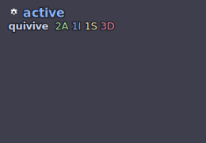

# Study: the quivive tile, and where the byte-sync rule came from

Field evidence, not doctrine. The `quivive` tile is the first tile in this
repository whose data comes from a producer with its own contract document and
its own golden fixtures. Landing it took four commits, three of which were
corrections — and each correction produced a rule that now applies to every
tile. This is the record of what was actually wrong.

## What was built

A fleet-presence status bar for the repositories
[quivive](https://github.com/chussenot/quivive) watches: an overall status
header, a row per repo with agent counts in a four-state machine
(`ACTIVE`/`IDLE`/`STALE`/`DEAD`), and an attention line per attention item.
`human-needed` pulses the whole tile.

Not a mockup: `quivive tile` run against quivive's own committed
`.pact/events.jsonl`, rendered by this tile. The screenshot is evidence that the
tile paints, which is why the
[documentation contract](../documentation.md#diagrams) allows rendered
screenshots anywhere and bans hand-drawn ones.

## Correction 1 — hand-authored samples drifted from the emitter

The tile shipped with samples written by reading quivive's contract doc. They
were plausible and wrong in two ways: they omitted `path` entirely, and their
indentation did not match what `serde_json::to_string_pretty` emits.

The fix regenerated all five from quivive's own tick output, so each is now
**byte-identical** to `tests/goldens/<name>.json` in the quivive repo.

Interestingly, the field that had been flagged as invented — `repos[].name` —
turned out to match the real emitter exactly. The guess was right; the
*confidence* was not, and nothing in the tree could tell the two apart.

**Rule produced.** Where a producer carries goldens, a tile's `samples/` are
byte-identical copies of them, and neither side is hand-edited. A copy that
"looks right" is not verified, and the difference between a lucky guess and a
checked fact is invisible until it costs you.

**Enforcement.** `tests/tile_gate.rs` compares the two sides against a sibling
quivive checkout and **skips loudly** when that checkout is absent. A silent skip
would read as a pass, which would restore exactly the condition this correction
removed.

## Correction 2 — the schema described the template, not the payload

Two disagreements with quivive's real contract:

- **`at` was not `required`.** The schema excused itself on the grounds that
  this tile's template does not render `at`. That is the wrong test. A schema
  describes the payload; what the template happens to bind is a separate
  question, and `pwetty check` already answers it.
- **`agents` had `additionalProperties: false`.** quivive's contract explicitly
  allows additive changes and requires consumers to ignore fields they do not
  know. A new count bucket would have been *valid upstream and rejected here* —
  the schema would have broken a change the contract permits.

**Rule produced.** Schemas defer to the producer's contract as source of truth,
tolerate unknown fields (`additionalProperties: true`), and set `required` to
what the producer *always* emits — not to what the samples happen to contain and
not to what the template happens to read. The question every schema change has
to answer is "additive or breaking?", and it is answered on the producer's side.

## Correction 3 — the gate cried wolf

`pwetty check quivive` reported that the template bound `status_hex` and
`status_icon` without the schema declaring them. Neither is data: both are
locals the template assigns per status to pick an accent colour.

minijinja's `undeclared_variables` walk scopes a `` to the ``
arm it appears in, so a name set in one arm and used after the ``
reads as undeclared. Jinja does not scope that way — `` opens no scope,
which is why the tile rendered correctly all along. The warning was the
checker's, not the schema's.

The fix subtracts the names a template sets from the names it binds
(`template_locals` in `src/bin/pwetty.rs`, with a test pinning the
set-inside-`if` case).

**Rule produced.** A gate that cries wolf on a correct input is one people learn
to read past, and a gate people read past is worse than no gate: it produces
false confidence at both ends. Fix the checker.

## What it cost

Four commits, three of them corrections, all after the tile "worked". None of
the three was found by running the tile — it rendered correctly throughout. They
were found by comparing the tile against the producer's own artifacts, which is
the activity the tile gate now automates.

## What still is not covered

`pwetty check` does not validate samples *against* the schema — it checks
template-vs-schema and renders every sample, so a sample with a wrong type slips
through if the template tolerates it. That is
[deferral row 4](../adr/0003-yagni-deferral-register.md), with its trigger.
